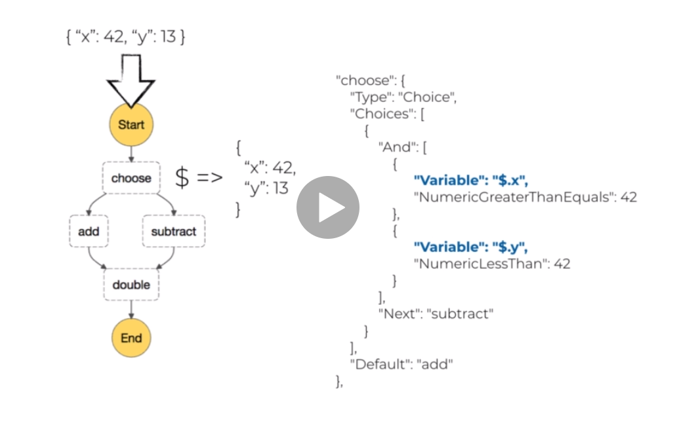
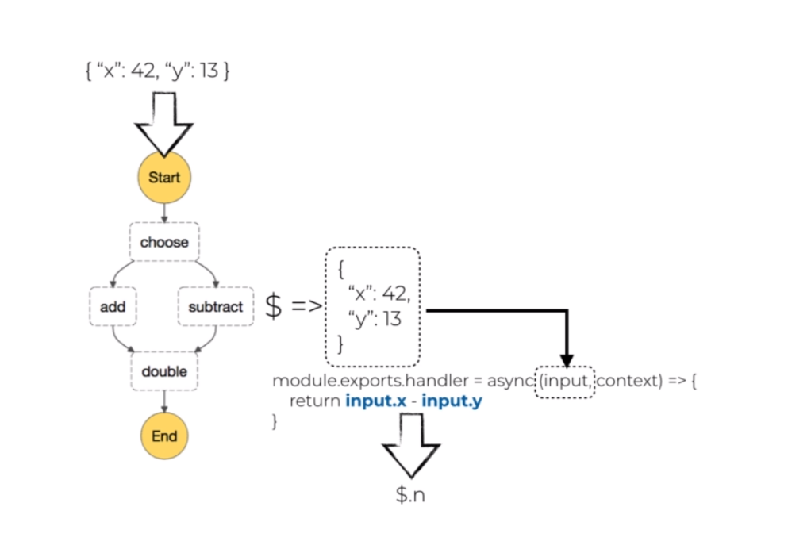
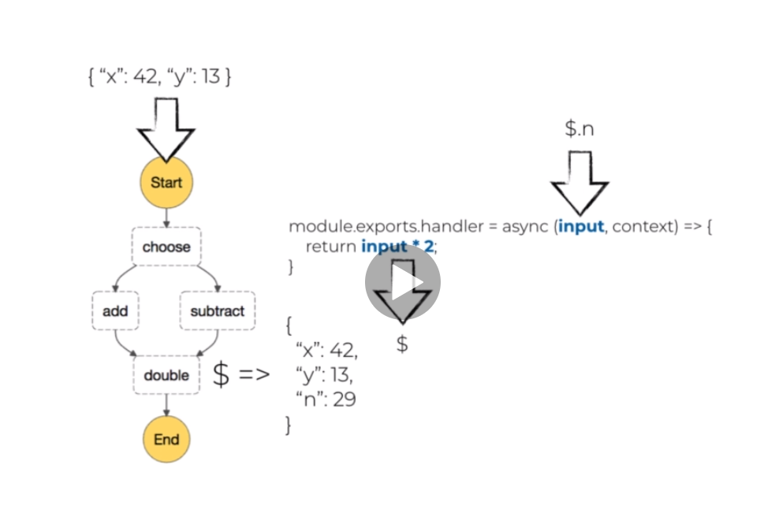
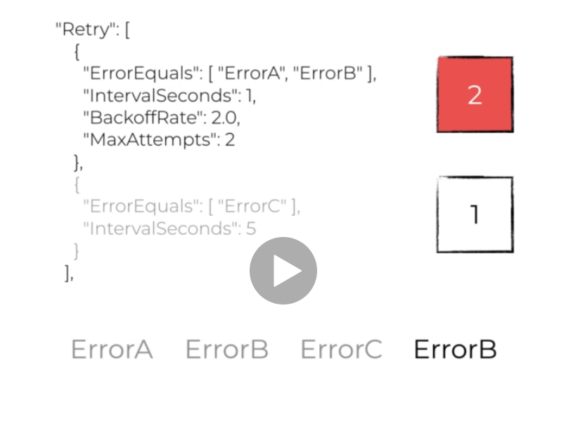
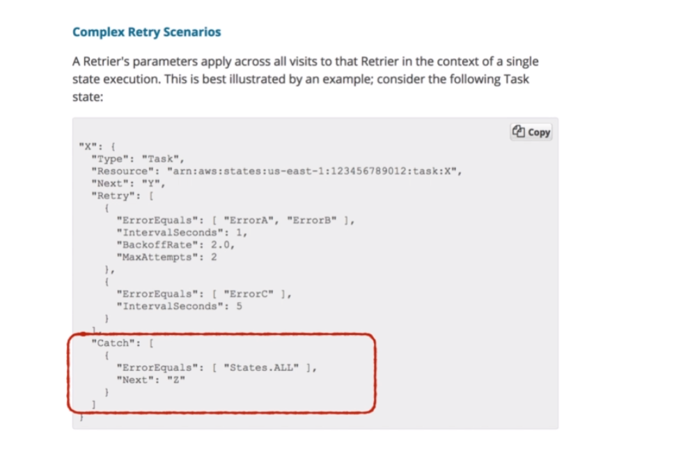

#### 3. What is Step Functions?

`Step Functions` is a orchestration service that allows you to model **workflows** as **state machines**

Cost: \$0.025 per 1,000 state transitions

#### 5. When to use Step Functions

Pros:

1. Visual
   - Great for collaboration with team members who are not engineers
   - make it easy for anyone to identify and debug application errors
2. error handling and retries
   - makes it easy for others to see without digging into the code
   - you don't have to consider retry and exponential backoff, etc
3. audit
   - full history of what happened. (keep for 90 days)

Cors: - cost

Consider to use it for below 3 scenarios

1. business critical workflows
   what: money related, e.g. payment and subscription flows
   why: more robust error handing worth the premium

2. Complex workflows
   what: complex workflows that involves many states, branching logic, etc
   why: visual workflow is a powerful design(for product) and diagnostic tool (for customer support)

3. long running workflow
   what: workflows that cannot complete in 15 minutes
   why: AWS discourages recursive Lambda functions, Step Functions gives you explicit branching checks, and can timeout at workflow level.

#### 6. The 7 types of states

1. Task - Perform a task (typically a Lambda function, but can be Activity, AWS Batch, ECS task, DynamoDB, SNS, SQS, AWS Glue, SageMaker)

```json
"TaskState": {
  "Type":"Task",
  "Resource":"<arn:resource>",
  "Next": "NextState",
  "TimeoutSeconds": 300 # default value 60s, even if function has longer timeout, set this to match your functions timeout
}
```

2. Pass - Passes input to output without doing any work

```json
"Nothing": {
  "Type":"Pass",
  "Result": {
    "is": 42
  },
  "ResultPath": "$.is",
  "Next":"NextState"
}
```

3. Wait - Wait before transitioning to next state

```json
"WaitTenSeconds": {
  "Type":"Wait",
  "Seconds":10,
  "Next":"NextState"
}
```

or until a particular timestamp

```json
"WaitUntil": {
  "Type":"Wait",
  "Timestamp":"2018-08-08T01:59:00Z",
  "Next":"NextState"
}
```

or you can specify how long to wait dynamically

```json
"WaitTenSeconds": {
  "Type":"Wait",
  "SecondsPath":"$.waitTime",
  "Next":"NextState"
}
```

```json
"WaitTenUtil": {
  "Type":"Wait",
  "TimestampPath":"$.waitUntil",
  "Next":"NextState"
}
```

4. Choice - Add branching logic to the state machine
   Below example, if input is {"name":"Cypher", "work":"IT"} then go the the "RedPill" branch, otherwise go to the default catch all "BluePill"

```json

"ChoiceState": {
  "Type":"Choice",
  "Choices": [
    "And":[
     {
        "Variable":"$.name",
        "StringEquals":"Cypher"
     },
     {
        "Variable":"$.work",
        "StringEquals":"IT"
     }
    ],
    "Next": "RedPill"
  ],
  "Default":"BluePill"
}
```

5. Parallel - Perform tasks in parallel. If one tasks fail, then the whole parallel workflow will fail

```json
"FunWithMath": {
  "Type":"Parallel",
  "Branches": [
    {
      "StartAt":"Add".
      "State":{
        "Add": {
          "Type":"Task",
           "Resource":"<arn:resource>",
           "End": true
        },
        ....other tasks
      }
    }
  ],
  "Next":"NextState"
}
```

6. Succeed - Terminate the state machine successfully.

```json
"SuccessState": {
  "Type":"Succeed"
}
```

7. Fail - Terminate the state machine and mark it as failure

```json
"FailState": {
  "Type":"Fail",
  "Error":"<Error Name>",
  "Cause":"some human readable reason"
}
```

#### 7. Managing execution state

1. When the execution starts, you have to provide input, like {"x": 42, "y": 13}, then this input is bounded to the execution state, represented by **\$**. Later on if you want to access the value of 'x', you can do **\$.x**



2. Because the condition is ($.x >= 42 and $.y < 42>), it will enter the "subtract" branch. here we can access the value from the `input` parameter. For the calculation result, we can save it to a "ResultPath", for example

```json
"subtract": {
  "Type":"Task",
  "Resource":"arn:<resource>",
  "Next":"double",
  "ResultPath":"$.n" # you can omit it, but the result will override the input
}
```


In above image, the subtract value will be saved into `$.n`. So for the next state "double", the "input" parameter will be "{"x": 42, "y": 13, "n": 29}"

3. For "double" state,

```json
"double": {
  "Type":"Task",
  "Resource":"arn:<resource>",
  "InputPath": "$.n",
  "End":true
}
```



Because we didn't specify `ResultPath`, the result will be saved to \$ root level, and "x", "y" and "n" are lost. So {"output": 58} becomes final output

#### 8. Error handling

Error handling in Step Functions includes Retry failed state + Catch if retries failed, then transition to failure path

Retry and Catch are only allowed in "Task" and "Parallel" state

A number of pre-defined error codes

1. States.ALL - A wild-card that matches any Error Name
2. States.Timeout - ran longer than the "TimeoutSeconds" value, or failed to send a heartbeat for a time longer than the "HeartbeatSeconds"
3. States.TaskFailed - Failed during the execution
4. States.Permissions - Failed because it has insufficient privilege to execute the specified code.

Custom error name CANNOT use prefix `States.`



In above image, if we got 4 errors, ErrorA->ErrorB->ErrorC->ErrorB, then the first retrier will fail because it reaches its `MaxAttempts` first.




#### 11. Express workflows
Express workflows is the cut-down version of Standard Step Functions, there is no visual tools, no audit tool, but you still have log in CloudWatch.  And it is lot cheaper.
