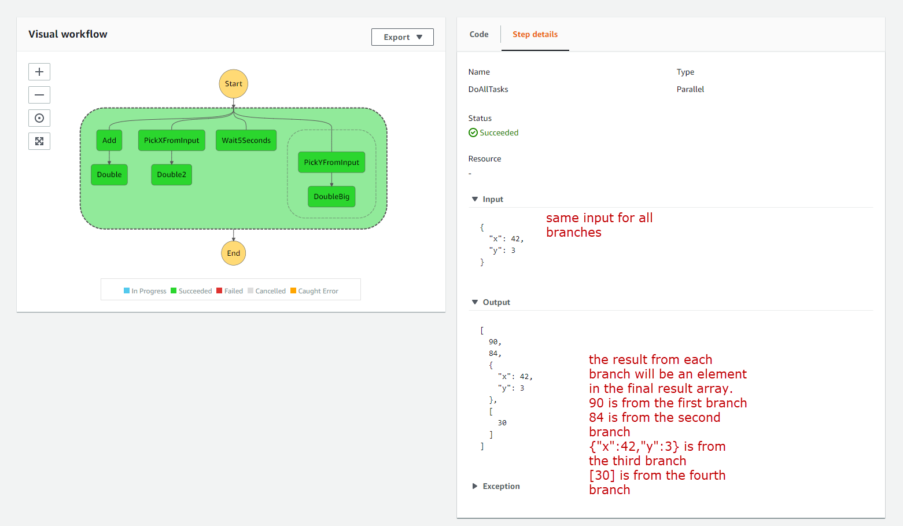

#### 13. Serverless framework and Step Functions

1. init serverless project

```
sls create -t aws-nodejs-typescript
npm i
```

2. install `serverless-step-functions` plugin

```
npm install --save-dev serverless-step-functions
```

Add the plugin to your serverless.yml file

```yml
plugins:
  - serverless-step-functions
```

A simple sls step function:

```yml
service:
  name: cmp-guide-step-functions
# app and org for use with dashboard.serverless.com
#app: your-app-name
#org: your-org-name

custom:
  webpack:
    webpackConfig: ./webpack.config.js
    includeModules: true

# Add the serverless-webpack plugin
plugins:
  - serverless-webpack
  - serverless-step-functions

provider:
  name: aws
  runtime: nodejs12.x
  apiGateway:
    minimumCompressionSize: 1024 # Enable gzip compression for responses > 1 KB
  environment:
    AWS_NODEJS_CONNECTION_REUSE_ENABLED: 1

functions:
  hello:
    handler: handler.hello
    events:
      - http:
          method: get
          path: hello

stepFunctions:
  stateMachines:
    myStateMachine:
      name: myStateMachine # name of the state machine
      definition:
        Comment: my first state machine
        StartAt: SayHello
        States:
          SayHello:
            Type: Task
            Resource:
              Fn::GetAtt: [hello, Arn]
            End: true
```

And handler.ts

```ts
import "source-map-support/register";

interface Data {
  name: string;
}

export const hello = async ({ name }: Data) => {
  return {
    statusCode: 200,
    body: JSON.stringify(
      {
        message: `Hello ${name}`,
      },
      null,
      2
    ),
  };
};
```


#### 14. Chaining function calls

```yml
service:
  name: cmp-guide-step-functions
# app and org for use with dashboard.serverless.com
#app: your-app-name
#org: your-org-name

custom:
  webpack:
    webpackConfig: ./webpack.config.js
    includeModules: true

# Add the serverless-webpack plugin
plugins:
  - serverless-webpack
  - serverless-step-functions

provider:
  name: aws
  runtime: nodejs12.x
  stage: ${opt:stage, 'dev'}
  region: ${opt:region, 'ap-southeast-2'}
  apiGateway:
    minimumCompressionSize: 1024 # Enable gzip compression for responses > 1 KB
  environment:
    AWS_NODEJS_CONNECTION_REUSE_ENABLED: 1

functions:
  add:
    handler: handler.add

  double:
    handler: handler.double

stepFunctions:
  stateMachines:
    mathStateMachine:
      name: mathStateMachine
      definition:
        Comment: my math state machine
        StartAt: Add
        States:
          Add:
            Type: Task
            Resource:
              Fn::GetAtt: [add, Arn]
            ResultPath: $.n
            Next: Double
          Double:
            Type: Task
            Resource:
              Fn::GetAtt: [double, Arn]
            InputPath: $.n
            End: true
```

Note here, `ResultPath: $.n` and `InputPath: $.n` are all optional.

- Without `ResultPath: $.n`, the result of `add` will be saved to root of $, and $.x and \$.y will be lost
- `InputPath: $.n` if it is specified, then the input for `double` will be a number, which is 55. If it is NOT specified, then the input will be {"x": 42, "y":13, "n": 55}

handle.ts

```ts
import "source-map-support/register";

interface Data {
  x: number;
  y: number;
  n: number | null;
}

export const add = async ({ x, y }: Data): Promise<number> => {
  return x + y; // if we specified ResultPath, then the result will be saved into ResultPath
};

export const double = async (n: number): Promise<number> => {
  return n * 2;
};
```

#### 15. Retry

We add some code to intenionally fail the execution

```ts
import "source-map-support/register";

interface Data {
  x: number;
  y: number;
  n: number | null;
}

class NumberIsTooBigError extends Error {
  constructor(n: number) {
    super(`${n} is too big`);
    this.name = "NumberIsTooBigError";
    Error.captureStackTrace(this, NumberIsTooBigError);
  }
}

export const add = async ({ x, y }: Data): Promise<number> => {
  return x + y; // if we specified ResultPath, then the result will be saved into ResultPath
};

export const double = async (n: number): Promise<number> => {
  if (n > 50) throw new NumberIsTooBigError(n);
  return n * 2;
};
```

And setup retry logic in serverless.yml

```yml
service:
  name: cmp-guide-step-functions
# app and org for use with dashboard.serverless.com
#app: your-app-name
#org: your-org-name

custom:
  webpack:
    webpackConfig: ./webpack.config.js
    includeModules: true

# Add the serverless-webpack plugin
plugins:
  - serverless-webpack
  - serverless-step-functions

provider:
  name: aws
  runtime: nodejs12.x
  stage: ${opt:stage, 'dev'}
  region: ${opt:region, 'ap-southeast-2'}
  apiGateway:
    minimumCompressionSize: 1024 # Enable gzip compression for responses > 1 KB
  environment:
    AWS_NODEJS_CONNECTION_REUSE_ENABLED: 1

functions:
  add:
    handler: handler.add

  double:
    handler: handler.double

stepFunctions:
  stateMachines:
    mathStateMachine:
      name: mathStateMachine
      definition:
        Comment: my math state machine
        StartAt: Add
        States:
          Add:
            Type: Task
            Resource:
              Fn::GetAtt: [add, Arn]
            ResultPath: $.n
            Next: Double
          Double:
            Type: Task
            Resource:
              Fn::GetAtt: [double, Arn]
            InputPath: $.n
            End: true
            Retry:
              - ErrorEquals: [States.ALL]
                MaxAttempts: 3
```

And you will see there are 4 failed executions. 1 for initial execution + 3 retries


We can have different settings for different types of errors. For example the retrier for `NumberIsTooBigError`, we set 0 retry.

```yml
Retry:
  - ErrorEquals: [NumberIsTooBigError]
    MaxAttempts: 0
  - ErrorEquals: [States.ALL]
    MaxAttempts: 3
```

execute

```
 sls invoke stepf --name mathStateMachine --data '{"x":42, "y":13}'
```

this time we see there is no retry


#### 16. Catch

We can add catch logic to catch any error from previous States

```ts
service:
  name: cmp-guide-step-functions
# app and org for use with dashboard.serverless.com
#app: your-app-name
#org: your-org-name

custom:
  webpack:
    webpackConfig: ./webpack.config.js
    includeModules: true

# Add the serverless-webpack plugin
plugins:
  - serverless-webpack
  - serverless-step-functions

provider:
  name: aws
  runtime: nodejs12.x
  stage: ${opt:stage, 'dev'}
  region: ${opt:region, 'ap-southeast-2'}
  apiGateway:
    minimumCompressionSize: 1024 # Enable gzip compression for responses > 1 KB
  environment:
    AWS_NODEJS_CONNECTION_REUSE_ENABLED: 1

functions:
  add:
    handler: handler.add

  double:
    handler: handler.double

stepFunctions:
  stateMachines:
    mathStateMachine:
      name: mathStateMachine
      definition:
        Comment: my math state machine
        StartAt: Add
        States:
          Add:
            Type: Task
            Resource:
              Fn::GetAtt: [add, Arn]
            ResultPath: $.n
            Next: Double
          Double:
            Type: Task
            Resource:
              Fn::GetAtt: [double, Arn]
            InputPath: $.n
            End: true
            Retry:
              - ErrorEquals: [NumberIsTooBigError]
                MaxAttempts: 0
              - ErrorEquals: [States.ALL]
                MaxAttempts: 3
            Catch:
              - ErrorEquals: [NumberIsTooBigError]
                Next: DefaultResponse
          DefaultResponse:
            Type: Pass
            Result: An error has occurred
            End: true

```

In above code, if there is any `NumberIsTooBigError`, then we have a logic to return a default error message.


#### 17. Branching

```ts
service:
  name: cmp-guide-step-functions
# app and org for use with dashboard.serverless.com
#app: your-app-name
#org: your-org-name

custom:
  webpack:
    webpackConfig: ./webpack.config.js
    includeModules: true

# Add the serverless-webpack plugin
plugins:
  - serverless-webpack
  - serverless-step-functions

provider:
  name: aws
  runtime: nodejs12.x
  stage: ${opt:stage, 'dev'}
  region: ${opt:region, 'ap-southeast-2'}
  apiGateway:
    minimumCompressionSize: 1024 # Enable gzip compression for responses > 1 KB
  environment:
    AWS_NODEJS_CONNECTION_REUSE_ENABLED: 1

functions:
  add:
    handler: handler.add

  double:
    handler: handler.double

  doubleBigNumber:
    handler: handler.doubleBigNumber

stepFunctions:
  stateMachines:
    mathStateMachine:
      name: mathStateMachine
      definition:
        Comment: my math state machine
        StartAt: Add
        States:
          Add:
            Type: Task
            Resource:
              Fn::GetAtt: [add, Arn]
            ResultPath: $.n
            Next: IsBigNumber
          IsBigNumber:
            Type: Choice
            Choices:
              - Variable: $.n
                NumericGreaterThan: 50
                Next: DoubleBigNumber
            Default: Double
          Double:
            Type: Task
            Resource:
              Fn::GetAtt: [double, Arn]
            InputPath: $.n
            End: true
            Retry:
              - ErrorEquals: [NumberIsTooBigError]
                MaxAttempts: 0
              - ErrorEquals: [States.ALL]
                MaxAttempts: 3
            Catch:
              - ErrorEquals: [NumberIsTooBigError]
                Next: DefaultResponse
          DoubleBigNumber:
            Type: Task
            Resource:
              Fn::GetAtt: [doubleBigNumber, Arn]
            InputPath: $.n
            End: true
          DefaultResponse:
            Type: Pass
            Result: An error has occurred
            End: true

```

In above code, `IsBigNumber` has 1 branch, if \$.n > 50, then go to state `DoubleBigNumber`, otherwise, go to Default which is `Double` state

handler.ts

```ts
import "source-map-support/register";

interface Data {
  x: number;
  y: number;
  n: number | null;
}

class NumberIsTooBigError extends Error {
  constructor(n: number) {
    super(`${n} is too big`);
    this.name = "NumberIsTooBigError";
    Error.captureStackTrace(this, NumberIsTooBigError);
  }
}

export const add = async ({ x, y }: Data): Promise<number> => {
  return x + y; // if we specified ResultPath, then the result will be saved into ResultPath
};

export const double = async (n: number): Promise<number> => {
  if (n > 50) throw new NumberIsTooBigError(n);
  return n * 2;
};

export const doubleBigNumber = async (n: number): Promise<number> => {
  return n * 10;
};
```

Test with big result

```
sls invoke stepf --name mathStateMachine --data '{"x":42, "y":13}'
```


Test with small result

```
sls invoke stepf --name mathStateMachine --data '{"x":42, "y":3}'
```


#### 18. Parallel tasks

- Parallel tasks will run multiple branches at the same time, based on **same input**.
- Parallel tasks can be nested inside of other parallel tasks.
- **no duplicate** state names in the whole state machine
- a Parallel state execution completes when all its branches have completed
- **Outputs** from branches are collected into an **array**, and follows the **same order** as the branches
- If one of the branch fail, then the whole parallel task will fail, in-progress/waiting states are cancelled.

```yml
service:
  name: cmp-guide-step-functions
# app and org for use with dashboard.serverless.com
#app: your-app-name
#org: your-org-name

custom:
  webpack:
    webpackConfig: ./webpack.config.js
    includeModules: true

# Add the serverless-webpack plugin
plugins:
  - serverless-webpack
  - serverless-step-functions

provider:
  name: aws
  runtime: nodejs12.x
  stage: ${opt:stage, 'dev'}
  region: ${opt:region, 'ap-southeast-2'}
  apiGateway:
    minimumCompressionSize: 1024 # Enable gzip compression for responses > 1 KB
  environment:
    AWS_NODEJS_CONNECTION_REUSE_ENABLED: 1

functions:
  add:
    handler: handler.add

  double:
    handler: handler.double

  doubleBigNumber:
    handler: handler.doubleBigNumber

stepFunctions:
  stateMachines:
    mathStateMachine:
      name: mathStateMachine
      definition:
        Comment: my math state machine
        StartAt: DoAllTasks
        States:
          DoAllTasks:
            Type: Parallel
            Branches:
              - StartAt: Add
                States:
                  Add:
                    Type: Task
                    Resource:
                      Fn::GetAtt: [add, Arn]
                    Next: Double
                  Double:
                    Type: Task
                    Resource:
                      Fn::GetAtt: [double, Arn]
                    End: true
              - StartAt: PickXFromInput
                States:
                  PickXFromInput:
                    Type: Pass
                    InputPath: $.x
                    Next: Double2
                  Double2:
                    Type: Task
                    Resource:
                      Fn::GetAtt: [double, Arn]
                    End: true
              - StartAt: Wait5Seconds
                States:
                  Wait5Seconds:
                    Type: Wait
                    Seconds: 5
                    End: true
              - StartAt: NestedParallel
                States:
                  NestedParallel:
                    Type: Parallel
                    Branches:
                      - StartAt: PickYFromInput
                        States:
                          PickYFromInput:
                            Type: Pass
                            InputPath: $.y
                            Next: DoubleBig
                          DoubleBig:
                            Type: Task
                            Resource:
                              Fn::GetAtt: [doubleBigNumber, Arn]
                            End: true
                    End: true
            End: true
```

Above template will generate below state machine



#### 21. Map

Takes an array of input, and run tasks in parallel. Each item in the input array will be the input for each parallel task.


```yml
service:
  name: cmp-guide-step-functions
# app and org for use with dashboard.serverless.com
#app: your-app-name
#org: your-org-name

custom:
  webpack:
    webpackConfig: ./webpack.config.js
    includeModules: true

# Add the serverless-webpack plugin
plugins:
  - serverless-webpack
  - serverless-step-functions

provider:
  name: aws
  runtime: nodejs12.x
  stage: ${opt:stage, 'dev'}
  region: ${opt:region, 'ap-southeast-2'}
  apiGateway:
    minimumCompressionSize: 1024 # Enable gzip compression for responses > 1 KB
  environment:
    AWS_NODEJS_CONNECTION_REUSE_ENABLED: 1

functions:
  add:
    handler: handler.add

  double:
    handler: handler.double

  doubleBigNumber:
    handler: handler.doubleBigNumber

stepFunctions:
  stateMachines:
    mathStateMachine:
      name: mathStateMachine
      definition:
        Comment: my math state machine
        StartAt: myTaskMap
        States:
          myTaskMap:
            Type: Map
            Iterator:
              StartAt: Wait5Seconds
              States:
                Wait5Seconds:
                  Type: Wait
                  Seconds: 5
                  Next: PickN
                PickN:
                  Type: Pass
                  InputPath: $.n
                  Next: Double
                Double:
                  Type: Task
                  Resource:
                    Fn::GetAtt: [double, Arn]
                  End: true
            End: true

```

to invoke

```
 sls invoke stepf --name mathStateMachine --data '[{"n":2},{"n":3},{"n":4},{"n":5}]'
```

Output

```js
{
  executionArn: 'arn:aws:states:ap-southeast-2:4762873XXX71:execution:mathStateMachine:f8007c26-3260-4551-8678-d8a0480b5a1d',
  stateMachineArn: 'arn:aws:states:ap-southeast-2:4762873XXX71:stateMachine:mathStateMachine',
  name: 'f8007c26-3260-4551-8678-d8a0480b5a1d',
  status: 'SUCCEEDED',
  startDate: 2020-08-15T09:24:26.883Z,
  stopDate: 2020-08-15T09:24:32.577Z,
  input: '[{"n":2},{"n":3},{"n":4},{"n":5}]',
  output: '[4,6,8,10]'
}
```


In above example, we didn't specify `MaxConcurrency`, which means use as much concurrrency as possible, iteration will start at the same time


We can specify which property in the input object we want to iterate

In below code

```yml
            ItemsPath: $.inputs
            Parameters:
              n.$: $$.Map.Item.Value.n
              executionId.$: $$.Execution.Id
              groupId.$: $.groupId
```

`ItemsPath: $.inputs` means we want to iterate the `inputs` propety of the input object

`n.$: $$.Map.Item.Value.n` means take the `n` propety from the ` Map.Item.Value` from `$$`, which is the execution context, and put into the $ object for iterator

`executionId.$: $$.Execution.Id` means take the `Execution.Id` from the execution context, and put into the $ object for iterator

`groupId.$: $.groupId` means take the `groupId` property from $ input object, and put into  the $ object for iterator

We can test it with

```
sls invoke stepf --name mathStateMachine --data '{ "inputs": [{ "n": 1, "x": 100, "y": 100 }, { "n": 2, "x": 200, "y": 200 }, { "n": 3, "x": 300, "y": 300 }], "groupId": 42 }'
```

output

```js
{
  executionArn: 'arn:aws:states:ap-southeast-2:4762873XXX71:execution:mathStateMachine:5b9d71d5-afe1-41f5-b905-2978fd88217b',
  stateMachineArn: 'arn:aws:states:ap-southeast-2:4762873XXX71:stateMachine:mathStateMachine',
  name: '5b9d71d5-afe1-41f5-b905-2978fd88217b',
  status: 'SUCCEEDED',
  startDate: 2020-08-15T10:24:05.262Z,
  stopDate: 2020-08-15T10:24:10.406Z,
  input: '{ "inputs": [{ "n": 1, "x": 100, "y": 100 }, { "n": 2, "x": 200, "y": 200 }, { "n": 3, "x": 300, "y": 300 }], "groupId": 42 }',
  output: '[{"executionId":"arn:aws:states:ap-southeast-2:4762873XXX71:execution:mathStateMachine:5b9d71d5-afe1-41f5-b905-2978fd88217b","groupId":42,"n":1},{"executionId":"arn:aws:states:ap-southeast-2:4762873XXX71:execution:mathStateMachine:5b9d71d5-afe1-41f5-b905-2978fd88217b","groupId":42,"n":2},{"executionId":"arn:aws:states:ap-southeast-2:4762873XXX71:execution:mathStateMachine:5b9d71d5-afe1-41f5-b905-2978fd88217b","groupId":42,"n":3}]'
}
```


```yml
service:
  name: cmp-guide-step-functions
# app and org for use with dashboard.serverless.com
#app: your-app-name
#org: your-org-name

custom:
  webpack:
    webpackConfig: ./webpack.config.js
    includeModules: true

# Add the serverless-webpack plugin
plugins:
  - serverless-webpack
  - serverless-step-functions

provider:
  name: aws
  runtime: nodejs12.x
  stage: ${opt:stage, 'dev'}
  region: ${opt:region, 'ap-southeast-2'}
  apiGateway:
    minimumCompressionSize: 1024 # Enable gzip compression for responses > 1 KB
  environment:
    AWS_NODEJS_CONNECTION_REUSE_ENABLED: 1

functions:
  add:
    handler: handler.add

  double:
    handler: handler.double

  doubleBigNumber:
    handler: handler.doubleBigNumber

stepFunctions:
  stateMachines:
    mathStateMachine:
      name: mathStateMachine
      definition:
        Comment: my math state machine
        StartAt: myTaskMap
        States:
          myTaskMap:
            Type: Map
            ItemsPath: $.inputs
            Parameters:
              n.$: $$.Map.Item.Value.n
              executionId.$: $$.Execution.Id
              groupId.$: $.groupId
            Iterator:
              StartAt: Wait5Seconds
              States:
                Wait5Seconds:
                  Type: Wait
                  Seconds: 5
                  End: true
            End: true

```

