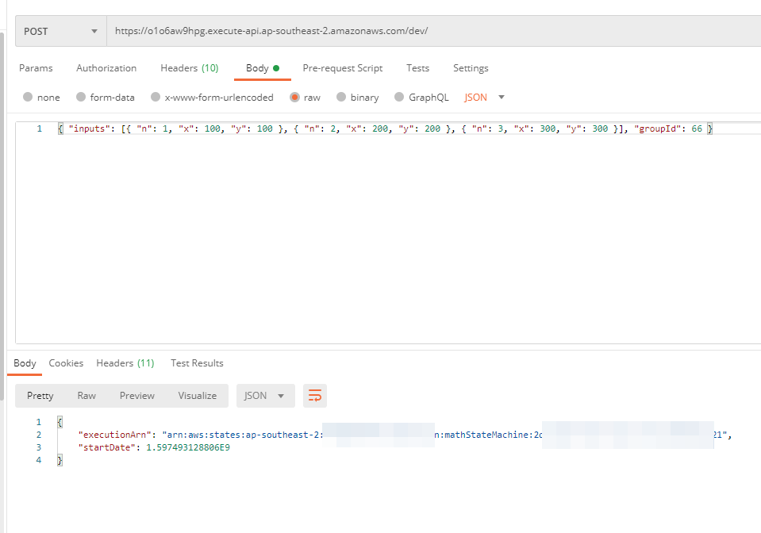
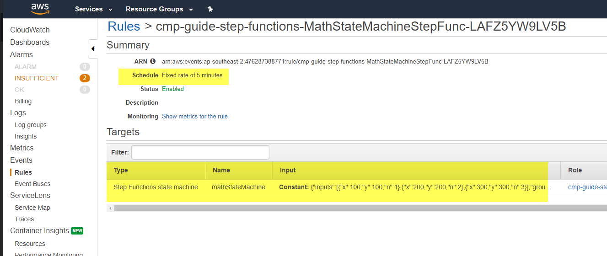

#### 23. API Gateway

Step functions can be triggered by http calls via API Gateway

```yml
service:
  name: cmp-guide-step-functions
# app and org for use with dashboard.serverless.com
#app: your-app-name
#org: your-org-name

custom:
  webpack:
    webpackConfig: ./webpack.config.js
    includeModules: true

# Add the serverless-webpack plugin
plugins:
  - serverless-webpack
  - serverless-step-functions

provider:
  name: aws
  runtime: nodejs12.x
  stage: ${opt:stage, 'dev'}
  region: ${opt:region, 'ap-southeast-2'}
  apiGateway:
    minimumCompressionSize: 1024 # Enable gzip compression for responses > 1 KB
  environment:
    AWS_NODEJS_CONNECTION_REUSE_ENABLED: 1

functions:
  add:
    handler: handler.add

  double:
    handler: handler.double

  doubleBigNumber:
    handler: handler.doubleBigNumber

stepFunctions:
  stateMachines:
    mathStateMachine:
      name: mathStateMachine
      events:
        - http:
            path: /
            method: POST
      definition:
        Comment: my math state machine
        StartAt: myTaskMap
        States:
          myTaskMap:
            Type: Map
            ItemsPath: $.inputs
            Parameters:
              n.$: $$.Map.Item.Value.n
              executionId.$: $$.Execution.Id
              groupId.$: $.groupId
            Iterator:
              StartAt: Wait5Seconds
              States:
                Wait5Seconds:
                  Type: Wait
                  Seconds: 5
                  End: true
            End: true

```

All we added is like below, which will create a Edge Api Gateway for us.

```yml
      events:
        - http:
            path: /
            method: POST
```

and we can test with Postman



They are many things we can setup such as CORS, validation etc.

https://github.com/serverless-operations/serverless-step-functions#api-gateway

#### 24. CloudWatch Event

Step functions can be triggered by schdule from CloudWatch

```yml
      events:
        - schedule:
            rate: rate(5 minutes)
            input: 
              inputs:
                - x: 100
                  y: 100
                  n: 1
                - x: 200
                  y: 200
                  n: 2
                - x: 300
                  y: 300
                  n: 3
              groupId: 66
```

This will create a CloudWatch Event Rule like below:



It can also triggered by S3 events, but you have to **enable CloudTrail** first, becasue S3 events are via CloudTrail

To create a rule that triggers on an action by an AWS service that does not emit events, you can base the rule on API calls made by that service. The API calls are **recorded by AWS CloudTrail**. 

```yml
stepFunctions:
  stateMachines:
    mathStateMachine:
      name: mathStateMachine
      events:
        - cloudwatchEvent:
            event:
              source:
                - aws.s3
              detail-type:
                - AWS API Call via CloudTrail
              detail:
                eventSource:
                  - s3.amazonaws.com
                eventName:
                  - PutObject
                requestParameters:
                  bucketName: 
                    - test-serverless-stepf
      definition:
        Comment: my math state machine
        StartAt: PrintEvent
        States:
          PrintEvent:
            Type: Task
            Resource: 
              Fn::GetAtt: [print, Arn]
            End: true
```