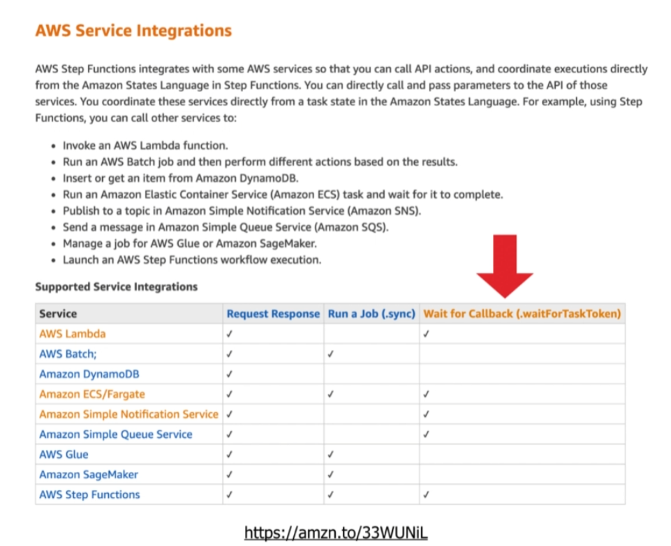
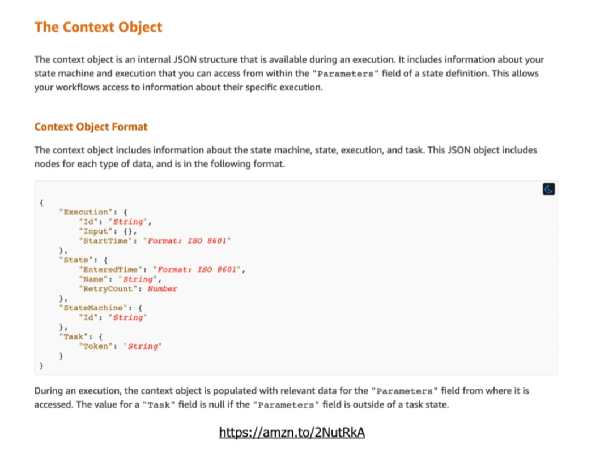
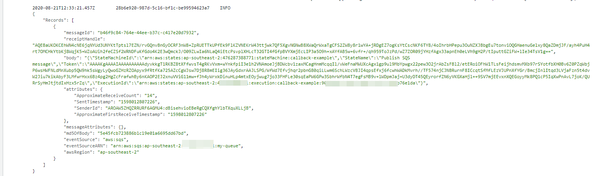

#### 31. What are callbacks?

1. Step Functions send a taskToken to a external service
2. Step Functions will suspend, and wait for someone, either the external service itself (Lambda), or the handler  (Lambda handler) of the external service (SQS, SNS, ECS, other Step Functions) to send back a { output, taskToken }
3. Once response with a valid taskToken is received, Step Functions will continue execution


Step Function Integration



The Context Object of Step Functions




#### 32. Configuring callbacks in serverless.yml

serverless.yml
```yml
service:
  name: cmp-guide-step-functions

plugins:
  - serverless-step-functions

provider:
  name: aws
  runtime: nodejs12.x
  stage: ${opt:stage, 'dev'}
  region: ${opt:region, 'ap-southeast-2'}
  iamRoleStatements:
    - Effect: Allow
      Action: states:SendTaskSuccess
      Resource: '*'

functions:
  sqs:
    handler: handler.sqs
    events:
      - sqs:
          arn:
            Fn::GetAtt: [MyQueue, Arn]
          batchSize: 1

  lambda:
    handler: handler.lambda

  sns:
    handler: handler.sns
    events:
      - sns:
          arn:
            Ref: MyTopic
          topicName: callback-topic

stepFunctions:
  validate: true
  stateMachines:
    callbackExample:      
      name: callback-example
      definition:
        Comment: Demonstrate how the use callbacks by sending Token
        StartAt: Publish SQS message
        States:
          Publish SQS message:
            Type: Task
            Resource: arn:aws:states:::sqs:sendMessage.waitForTaskToken
            Parameters:
              QueueUrl:
                Ref: MyQueue
              MessageBody:
                StateMachineId.$: $$.StateMachine.Id
                ExecutionId.$: $$.Execution.Id
                StateName.$: $$.State.Name
                Token.$: $$.Task.Token
            Next: Invoke Lambda
          Invoke Lambda:
            Type: Task
            Resource: arn:aws:states:::lambda:invoke.waitForTaskToken
            Parameters:
              FunctionName:
                Ref: lambda
              Payload:
                StateMachineId.$: $$.StateMachine.Id
                ExecutionId.$: $$.Execution.Id
                StateName.$: $$.State.Name
                Token.$: $$.Task.Token
            Next: Publish SNS message
          Publish SNS message:
            Type: Task
            Resource: arn:aws:states:::sns:publish.waitForTaskToken
            Parameters:
              TopicArn:
                Ref: MyTopic
              Message:
                StateMachineId.$: $$.StateMachine.Id
                ExecutionId.$: $$.Execution.Id
                StateName.$: $$.State.Name
                Token.$: $$.Task.Token
            End: true

resources:
  Resources:
    MyQueue:
      Type: AWS::SQS::Queue
      Properties:
        QueueName: my-queue

    MyTopic:
      Type: AWS::SNS::Topic
      Properties:
        DisplayName: callback-topic
        TopicName: callback-topic
```

From above example, you can see we extract `Task.Token` from Context Object, and put it into `MessageBody(SQS)`, `Payload(Lambda)` and `Message(SNS)`.

hanlder.js

```js
const AWS = require('aws-sdk')
const SFN = new AWS.StepFunctions()

module.exports.sqs = async event => {
  console.log(JSON.stringify(event))

  const record = event.Records[0]
  const body = JSON.parse(record.body)

  const response = await SFN.sendTaskSuccess({
    output: "42",
    taskToken: body.Token
  }).promise()

  return response
};

module.exports.lambda = async event => {
  console.log(JSON.stringify(event))

  const response = await SFN.sendTaskSuccess({
    output: "42",
    taskToken: event.Token
  }).promise()

  return response
};

module.exports.sns = async event => {
  console.log(JSON.stringify(event))

  const record = event.Records[0]
  const message = JSON.parse(record.Sns.Message)

  const response = await SFN.sendTaskSuccess({
    output: "42",
    taskToken: message.Token
  }).promise()
  return response
};

```

From above hanlder functions, we received token from event object, parst it based on the send type, then use 
```js
`SFN.sendTaskSuccess({
    output: "42",
    taskToken: body.Token
  })`
```
to send it back to Step Functions


To invoke:
```
sls invoke stepf --name callbackExample --data '{}'
```

Response

```json
{
  executionArn: 'arn:aws:states:ap-southeast-2:4762xxxxxx771:execution:callback-example:d88949d0-351d-46c1-8987-2a313501ca81',
  stateMachineArn: 'arn:aws:states:ap-southeast-2:4762xxxxxx771:stateMachine:callback-example',
  name: 'd88949d0-351d-46c1-8987-2a313501ca81',
  status: 'SUCCEEDED',
  startDate: 2020-08-21T12:36:42.667Z,
  stopDate: 2020-08-21T12:36:47.105Z,
  input: '{}',
  output: '42'
}
```

